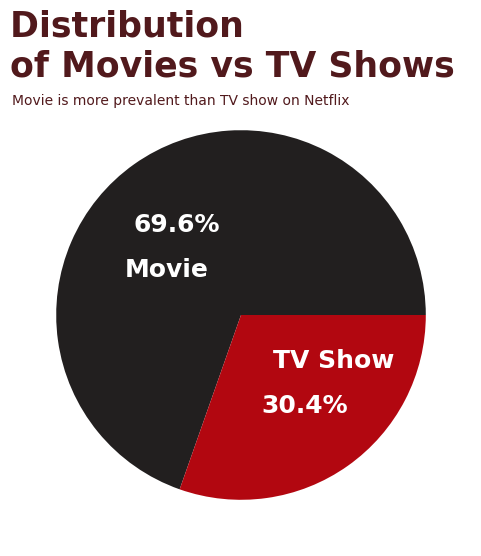
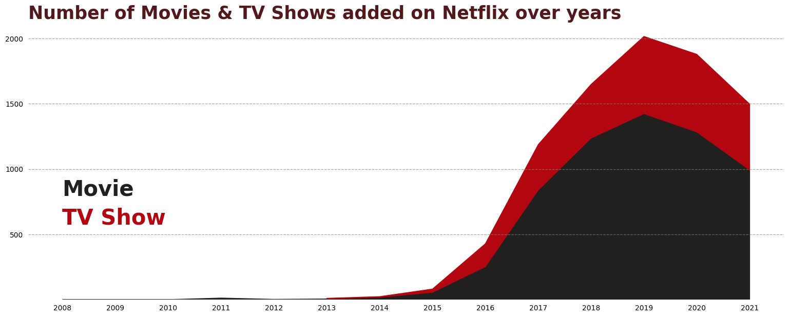
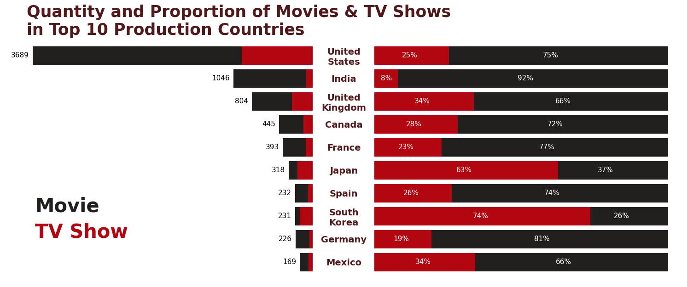
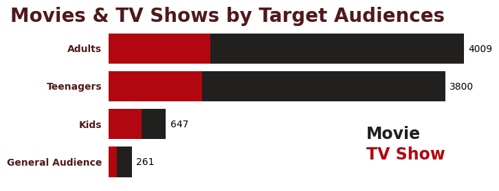
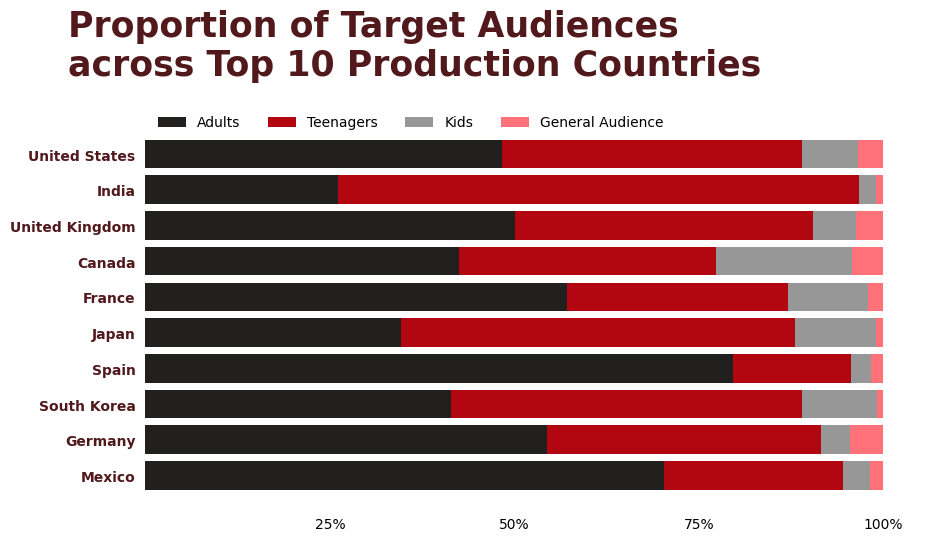
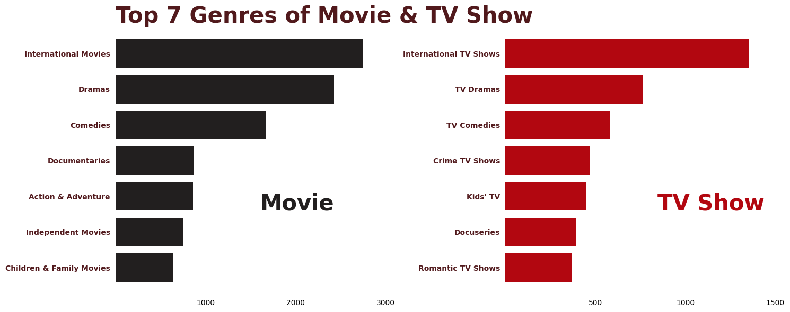
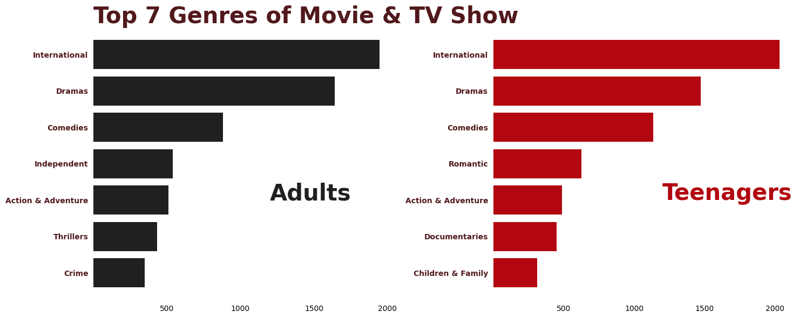

# INTRODUCTION

**This project analyzes the dataset containing information about Netflix movies and TV shows. The goal is to explore trends in the content library, understand the distribution of content by type, and gain insights into countries, target audience, and genres involved in Netflix productions.**

**Dataset Info**

1. Source: [Kaggle - Netflix Movies and TV Shows](https://www.kaggle.com/datasets/shivamb/netflix-shows)

2. Collected from Netflix as of 2021

3. Including 13 columns and 8809 rows

# ANALYSIS

## 1. Overview

2/3rd of the contents on Netflix are movies and remaining of them are TV Shows.

  

Netflix grew slowly over their first years. Things began to pick up in 2015 and then there was a dramatic increase from 2016. After that, Netflix content addition  started slowing down in 2020, likely due to the COVID-19 pandemic.

## 2. Top 10 Content Production Countries on Netflix

USA is significantly the top 1 contender. 

Most countries in top 10 tend to produce more Movies.

Japan and South Korea are relatively different from others that more than 50% of their show are TV Shows

## 3. Target Audiences

Overall, adult and teenager are the main user segments of Netflix.

There is a slight difference in target audiences among top 10 show making countries. Meanwhile, most countries focus on contents for adults, Asian countries such as India, South Korea, and Japan aim their target on teenagers.

## 4. Show Categories

Among movies and TV shows, top 3 show categories are internationality, drama, and comedy. The same result happens with adults and teenagers.

It seems to be understandable that most of the shows on Netflix were published globally to engage as many viewers as possible, therefore, internationality is one of crucial qualities film producers would concentrate on. In addition, drama and comedy are critical materials for building a thrilling script to keep subscriber engaged and excited. 

# CONCLUSION

Regarding the insights explored, non-Asian countries in the top 10 exhibit a preference for film production over TV, with a primary focus on adult audiences.

By contrast, Asian leaders such as South Korea and Japan concentrate on TV series aimed at teenagers.

India, however, shows a notable exception; it maintains a film-heavy output (90%) while simultaneously targeting a younger segment, indicating a mix of Asian and non-Asian characteristics.

Despite these regional differences above, there is a global trend toward utilizing international themes, drama, and comedy in scriptwriting.

# THANK YOU FOR READING

